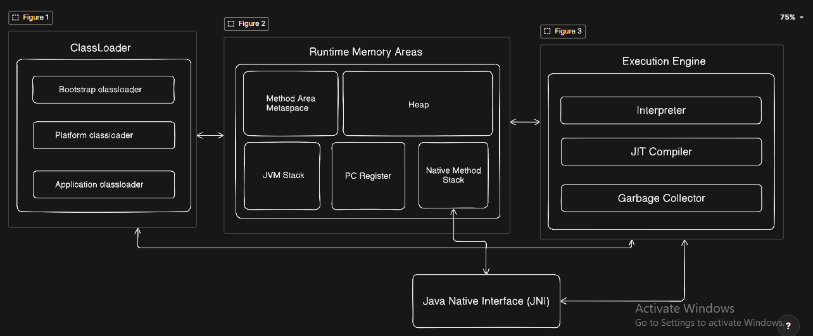

# JVM Architecture

## ClassLoader

A ClassLoader is a component of JVM Architecture, that makes a class ready to use.

### Types of ClassLoader
- Bootstrap (loads Java internal class like String ArrayList, etc)
- Platform/Extension (java 9+, loads classes of modules like java.sql)
- Applications (loads classes you write)

### ClassLoader Parent Delegation Model

When write `java Main` is request for loading goes to `Application ClassLoader` but it passes the request to parent `Platform ClassLoader` before it tries itself. same this way `Platform ClassLoader` passes the request to `Bootsrap ClassLoader` if parent finds the class in its scope the request gets satisfied. And if parent fails to locate the class it returns the request to the child.

### Steps of Class loading
1. Loading
2. Linking
3. Initialization

#### Loading
In this step ClassLoader:
- locates a .class file, with fully qualified name, com.app.main.App, java.lang.String
- loads it bytecode in byte[]
- parses the bytecode and prepares structured information called metadata.
- stores that metadata in metaspace in form of data structure called InstanceKlass.
- create a object of java.lang.Class, that contains reference to InstanceKlass, helps devs to read metadata.

#### Linking
This step performs three steps. verification, preparation, resolution.

**Verification:**
Here JVM verifies the correctness of bytecode, it performs type like it must start with 0xCAFEBABE, it checks if the bytecode of methods is malicious can create problems for JVM. Or there are some illegal thing like assigning a string into a int variable.

**Preparation:**
In this step, JVM allcates memory for all static variable and set them to there defaults value, if it is a Compile time constant JVM assign that field its actual value.

**Resolution:**
Java compiler prepares constant pool and embeds it in .class file. this constant pool contains unique entries used in this class. some of them are literals (string/numeric) and some are symbolic references to a field, method or class. In this step JVM replaces those symbolic references in constant pool with direct references. This happen lazily on demand.

#### Initialization
In this step, JVM invokes `<clinit>():V` function. which is built by javac (Java compiler) by combining all static variable initializers and static blocks.

---

## Runtime Memory Areas

There are two type of memory areas:
1. shared among thread (Method Area, Heap)
2. private for each thread (Stack, PC Register, Native Method Stack)

### Method Area - (premGen/Metaspace)
There are two Implementations of it:
1. PermGen (pre Java 8)
2. Metaspace (Java 8+)

**PermGen:**
It was old implementation of method area, it was part of heap. offered limited storage. managed by GC.

**Metaspace:**
It is current implementation, dynamic size. separate native memory not part of heap. not managed by Minor and Major GC like Heap.
- Managed by Full GC by checking Class Reachability.
- Store classes' metadata (InstanceKlass)
- Runtime constant pool
- static variables
- methods' bytecode

### Heap
- created at JVM start up.
- stores Instances of class.
- primary target of GC
- divided into generations
- OutOfMemoryError: when GC can't claim enough

### Stack
- Each thread gets its own Stack.
- Keeps frames in it. (A frame is pushed when a method is called)
- Frame is popped when method return.
- StackOverflowError: when stack exceed max size.

A Frame contains:
- local variable Array
- operand stack
- reference to constant pool of its class.

### PC Register
- Very small in size
- Just stores a reference to currently executing instructions
- managed by Interpreter
- remains undefined when a native method is being executed.

### Native Method Stack
- stack for native method calls
- methods written in c/c++
- or low level OS calls

---

## Execution Engine

Three parts:

**Interpreter:**
- Interprets the instructions one by one.
- Keeps updating PC Register.
- Unaware about how many time it has executed the same instruction.
- Fast start ups overall Execution remain slow.

**JIT (Just In Time):**
- Compiles the bytecode of hot code (repeatedly running code) into native machine code.
- keeps this native machine code in code cache which is part of native memory.
- pre java 7 we had to choose manually by using flags -client -server, now JVM does automatically called `Tiered Compilation`.
- first JVM using C1 and if gets much hotter JVM uses C2

Types of JIT compilers:
- C1 Compiler (client) - Fast compilation but less optimized. Fast Start.
- C2 Compiler (server) - Slow compilation but heavily optimized. Takes more time in optimizations

**Garbage Collector:**
- Reclaims memory from unreachable objects
