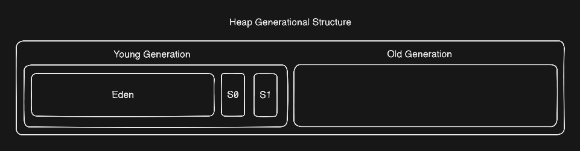

# Memory Management

In this topic we will only discuss how heap is managed by JVM. Because heap is most used runtime time memory area with non deterministic lifetime objects.

#### Here we will discuss following topics:

1. Generational Hypothesis
2. Heap's Generational Structure
3. Object Allocation (TLAB)
4. GC roots and Reachability
5. GC Algorithms
6. Object Promotion
7. Reference Types

## Generational Hypothesis

It is observed that most of the objects dies young(early).

#### Observations

- Vast majority of objects becomes unreachable shortly after creation.
- Objects those servive one GC cycle are more likely to servive longer.

#### Resulting Strategies
Since it was wasful to keep checking on long lived objects if there are still reachable.
- Divided heap into two generation `Young/Old`
- `Young Generation` where new objects are created.
- `Old Generation` where old/long lived objects are shifted.

## Heap's Generational Structure

Heap is divied into two generations `Young/Old`

#### Young Generation

Further young generation is divided into 3 part. Those are:

- Eden space - where objects are created.
- S0 and S1 space - they work in group, one is active at a time, other stays empty.
- Scaned by Minor GC, Frequently
- `Size Ratio:` `Eden:S0:S1 = 8:1:1`

#### Old Generation

Objects after hitting age threshold are shifted Old Generation.
- Stores long lived objects
- Scaned by Major GC not frequently
- Bigger size object are directly allocated in old generation
- `Size:` `old_gen = total_heap - young_gen`

## Object Allocation

Java in multi-threaded language, means in a single there may be multiple threads. So It is very thing that two threads tries to allocate object at the sametime. If they try to write objects on same memory locations it will corrupt the data. or if this process is made synchronized each thread will have to wait in queue for its turn. this is how most of the time will be wasted by waiting.

#### Solutions:

JVM gives each thread a TLAB (Thread Local Allocation Buffer). it is a chunk of memory carved out from Eden. where the thread can allocate objects without locking and waiting. TLAB is part of Eden not a separate thing so once a object is allocated now any other thread can read and modify. when TLAB fills up, JVM gives a new TLAB.

## GC Roots and Reachability

GC Roots are objects those are directly accessible from currently running code. Using these roots GC traverse the objects' graph and marks reachable objects as alive and reclaims memory from unreachable objects.

## GC Algorithms

Three GC algorithms are stated below

**Mark-Sweep:** While traversing the objects graph it marks alive objects and sweeps others. it fast but wastes memory due to fragmentation (gaps among alive objects that can never be reused if the object size is bigger the gap).

**Mark-Sweep-Compact:** Along with mark-sweep it also perform compaction. In simple words a sorting is performed to avoid wastage of memory. this algorithm is slow and expensive.

**Copying:** Memory is divided into two parts only one is active at a time other stays empty. when GC runs it marks alive objects and copies them into the other empty space.

### GC Cycles Types

1. **Minor GC:** Runs in young generations using copying algorithm, takes all alive objects and copy them into empty servivor space and after this clean Eden and previously servivor space. runs frequently.
2. **Major GC:** Runs in old generation and apply Mark-Sweep-Compact algorithm.
3. **Full GC:** it invokes Minor and Major GCs also invokes classunloader that unloads unreachable classes. rare, slow and expensive.

## Object Promotion

At first objects are created in Eden then alive objects gets promoted to servivor space then alive objects keep bouncing between servivor spaces until their age counter hits threshold. Once it is hit, the objects is promoted to old generation. we can set that threshold with `-XX:MaxTenuringTreshold`

**Early Promotion:** when servivor space overflows excess objects are directly promoted to Old Generation regardless of age called premature promotion. and very large objects may bypass young generation and get allocated directly in old generation. set size threshold `-XX:PretenureSizeThreshold`

## Reference Types

**Strong Reference:** Never collect if reachable.

**Soft Reference:** Never reclaimed if reachable until unless JVM running out of memory.

**Weak Reference:** Reclaimed on very next GC cycle

**Phantom Reference:** just for notification, it notifies you after it is reclaimed so you could do clean up work.

## Escape Analysis

It is a JIT C2 compiler optimization, where JIT verfies that an object created inside a method never escapes (never return, or passed to other methods). Then JIT allocates those objects in methods stack frame.

# Task

I see how fast G1 handles young generation, It ran around 500 times per minute under extreme load, when I was performing mass allocation without storing their references.

